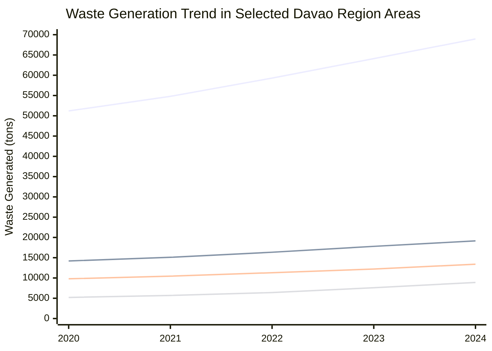
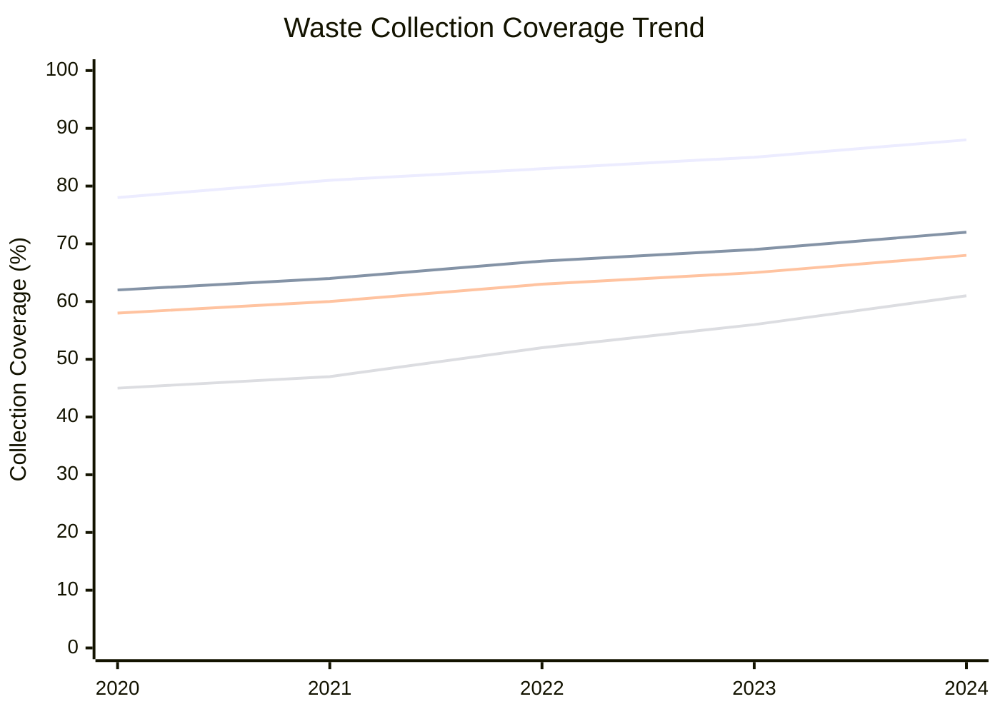

# GE-IT-SKILLS-Portfolio
## ABOUT ME
### Hi There! I am Neal Yrrej G. Padilla
### I am driven by strategy, creativity, and growth
## Brand Identity Hex Codes
* Primary Color `#121212`
* Secondary Color `#E5E5E5`
* Accent Color `#A6A6A6`

---

## Projects

### 1 The Samal Eco-Tourism Prompt System

#### 1. System Prompt Template

"Act as a Tourism Development Officer assigned to Samal Island, Davao del Norte. 

Context: Samal Island continues to attract more visitors each year, creating challenges related to waste management, environmental protection, and sustainable tourism practices.

Requirements: Use a professional and community-oriented tone. Focus only on Samal Island and its local stakeholders, including barangay officials, tourism operators, environmental organizations, and the City Tourism Office. Avoid using foreign tourism examples or international case studies.

Format: Present the response in Markdown and include exactly three recommendations under the heading '### Sustainable Tourism Interventions'."

#### 2. Prompt Battle Ledger

| Version | Changes Made | Reflection |
| :--- | :--- | :--- |
| V1 | Asked the AI to create a tourism plan for Samal Island. | The response was too general and could have applied to any tourist destination. |
| V2 | Added information about eco-tourism and community involvement. | The output became more relevant but still included examples from outside the Philippines. |
| V3 | Added local stakeholders, location-specific restrictions, and a required format. | The response became more focused on Samal Island and provided clearer recommendations for local use. |

#### 3. Visual Branding Asset

- **Engine Used:** Canva Magic Media
- **Visual Prompt:** "Flat minimalist vector icon featuring a coconut tree, ocean wave, and location pin. Clean geometric shapes, flat design, no gradients, no shadows, white background, dark green, blue, and gold color palette. Represents sustainable tourism in Samal Island, Davao del Norte."


### 2. Literature Verification Log

**Topic:** Sustainable Tourism Development in Samal Island, Davao del Norte

#### Project Overview

As an Academic Research Associate, I used an AI-assisted research tool to generate summaries of literature related to sustainable tourism development in Samal Island. To ensure the accuracy and reliability of the information, I manually reviewed the AI-generated outputs and compared them with government reports, academic publications, and official tourism documents. My objective was to identify unsupported claims, misleading interpretations, and potential biases before incorporating the information into policy-oriented research.

#### 1. AI-Generated Summary Audit Matrix

| AI-Generated Statement | Source Vetted Against | Status | Human Correction / Verification Note |
| :--- | :--- | :--- | :--- |
| "Tourism growth automatically improves the quality of life of all local residents." | Tourism development literature and community-based tourism studies | Overgeneralization | Tourism may create economic opportunities, but benefits vary depending on community participation and resource distribution. |
| "Samal Island has experienced continuous tourism growth in recent years." | Local government tourism reports and official tourism publications | Partially Verified | Tourism activity has generally increased, but trends should be supported by official annual data. |
| "Environmental conservation is essential for long-term tourism sustainability." | Sustainable tourism literature | Verified | Consistent with findings across multiple tourism studies. |
| "Community involvement strengthens tourism development efforts." | Community-based tourism research | Verified | Supported by literature emphasizing stakeholder participation in tourism planning. |
| "All tourism projects generate positive environmental outcomes." | Environmental impact assessments and tourism studies | Hallucination | Tourism projects may have both positive and negative environmental impacts depending on management practices. |

#### 2. Literature Matrix

| Author / Source | Key Finding |
| :--- | :--- |
| UNWTO Sustainable Tourism Framework | Sustainable tourism requires balancing economic, environmental, and social objectives. |
| Community-Based Tourism Studies | Local participation improves tourism outcomes and community support. |
| Environmental Conservation Literature | Natural resource protection contributes to long-term tourism sustainability. |
| Philippine Tourism Development Studies | Infrastructure and stakeholder collaboration influence tourism growth. |
| Regional Development Planning Documents | Tourism can contribute to local economic development when properly managed. |

#### 3. Critical Reflection on AI Tool Limitations

The AI tool helped me identify recurring themes and summarize large amounts of information within a short period. However, the review process revealed several limitations, including unsupported generalizations, assumptions presented as facts, and statements lacking sufficient evidence. These findings reinforced the importance of manually verifying AI-generated content before using it in academic or policy-related work.

#### 4. Conclusion

This verification exercise demonstrated the importance of combining AI-assisted research with human evaluation. By reviewing the generated summaries against credible sources, I was able to identify inaccuracies, correct misleading statements, and improve the overall reliability of the literature review. The process ensured that the final output remained academically sound and suitable for policy discussions.

### 3 Automated Visual Data Report

#### 1. Dataset Used

**Dataset Title:** Mindanao Municipal Waste Generation Dataset  
**Focus Area:** Davao Region  
**Data Coverage:** 2020–2024  
**Key Variables:** Year, City/Municipality, Waste Generated, Population, Collection Coverage, Notes

#### 2. Data Cleaning Summary

The raw dataset contained several formatting and structural issues. Some waste values had extra spaces, commas, and text formatting. There were also missing values in population and collection coverage, as well as one row marked as a duplicate or error.

During cleaning, I standardized the column names, removed unnecessary spaces, converted waste values into numeric format, checked missing entries, and excluded the row labeled as an error. I also reviewed the notes column to identify estimated values and incomplete barangay data. These adjustments made the dataset easier to compare across different cities and municipalities.

#### 3. Chart 1: Waste Generation Trend



#### 4. Chart 2: Waste Collection Coverage Trend



#### 5. Human Analytical Narrative

Based on the cleaned data, waste generation increased across the selected areas from 2020 to 2024. Davao City recorded the highest waste volume, which is expected because of its larger population and stronger urban activity. Samal also showed a clear increase, which may be connected to tourism recovery and higher visitor movement after the pandemic period.

The data shows an important socio-environmental concern in Mindanao. As cities expand and tourism areas become more active, LGUs need stronger waste collection systems, better barangay-level segregation, and improved disposal planning. If waste generation continues to rise faster than collection coverage, communities may face added pressure on drainage systems, coastal areas, and public health resources.

#### 6. Raw Dataset Reference

```csv
Year,Province/Municipality,Waste Generated (tons),Population,Coverage %,Notes
2020,Davao City," 51200 ",1776949,78,"complete"
2021,Davao City,54800,1800000,81,
2022,Davao City,"59,300",1825000,83,"new collection routes"
2023,Davao City,64100,1850000,85,
2024,Davao City,68950,1880000,88,"estimate"
2020,Tagum City,14200,296202,62,""
2021,Tagum City,"15,100",301000,64,"partial barangay data"
2022,Tagum City,16350,305000,67,
2023,Tagum City,17800,309000,69,""
2024,Tagum City,19150,313000,72,"estimate"
2020,Panabo City,9800,209230,58,
2021,Panabo City,10450,213000,60,
2022,Panabo City," 11,300 ",217000,63,"format issue"
2023,Panabo City,12200,221000,65,
2024,Panabo City,13400,225000,68,"estimate"
2020,Island Garden City of Samal,5200,116771,45,"tourism affected"
2021,Island Garden City of Samal,5700,119000,47,
2022,Island Garden City of Samal,"6,400",122000,52,"tourism recovery"
2023,Island Garden City of Samal,7600,125000,56,
2024,Island Garden City of Samal,8900,128000,61,"tourism increase"
2020,Digos City,8700,188376,55,
2021,Digos City,9100,191000,57,
2022,Digos City,9700,194000,60,
2023,Digos City,"10,800",197000,62,
2024,Digos City,11650,200000,64,"estimate"
2020,Mati City,6900,147547,49,
2021,Mati City,7300,150000,51,
2022,Mati City,8100,153000,54,
2023,Mati City,8750,156000,57,
2024,Mati City,"9,600",159000,60,"estimate"
2022,Davao City,N/A,1825000,83,"duplicate/error row"
2023,Tagum City,17800,,69,"missing population"
2024,Panabo City,13400,225000,,missing coverage
```
